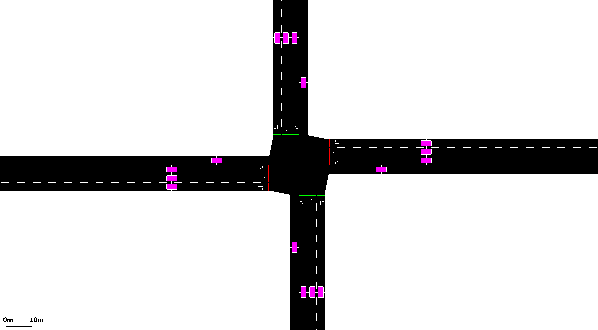
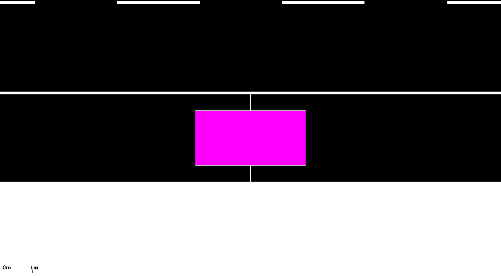

## Instantiating within the Simulation

An instantaneous induction loop is defined this way within an additional
file like this:

```
<instantInductionLoop id="<ID>" lane="<LANE_ID>" pos="<POSITION_ON_LANE>" file="<OUTPUT_FILE>" [friendlyPos="x"]/>
```


The "`id`" is any string by which you can name
the detector. The attributes "`lane` and
"`pos`" describe on which lane and at which
position on this lane the detector shall lay. The "file" attribute tells
the simulation to which file the detector shall write his results into.
The file will be generated, does not have to exist earlier and will be
overwritten if existing without any warning. The folder the output file
shall be generated in must exist.

The attributes:

| Attribute Name | Value Type         | Description                                                                                           |
| -------------- | ------------------ | ------------------------------------------------------------------------------------------------------ |
| **id**         | id (string)        | The id of the detector                                                                                |
| **lane**       | referenced lane id | The id of the lane the detector shall be laid on. The lane must be a part of the network used.         |
| **pos**        | float              | The position on the lane the detector shall be laid on in meters. The position must be a value between -1\*lane's length and the lane's length. In the case of a negative value, the position will be computed backward from the lane's end (the position the vehicles drive towards). |
| **file**       | filename           | The path to the output file. The path may be relative. If output is to be discarded "NUL" or "/dev/null" can be given.      |
| friendlyPos    | bool               | If set, no error will be reported if the detector is placed behind the lane. Instead, the detector will be placed 0.1 meters from the lane's end or at position 0.1, if the position was negative and larger than the lane's length after multiplication with -1.                      |
| vTypes         | string             | space separated list of vehicle type ids to consider, "" means all; default "".                       |

!!! note
    Instead of manually defining detectors in an xml file, they can also be defined visually with [NETEDIT](../../NETEDIT.md).

## Generated Output

An instantaneous induction loop is writing a value to the output as soon
as a vehicle was detected. This detector differs between different
states:

- "enter": a vehicle has entered the detector in this simulation step
- "stay": a vehicle which entered the detector in a prior step is
  still on the detector
- "leave": a vehicle has left the detector in this simulation step

The following values are reported in all cases:

| Name   | Type | Description                                    |
| ------ | ---- | ---------------------------------------------- |
| id     | id   | The id of the detector                         |
| time   | s    | The time the event occured                     |
| state  |      | The event type, see above                      |
| vehID  |      | The id of the vehicle which is on the detector |
| speed  | m/s  | The speed of the vehicle in this time step     |
| length | m    | The length of the vehicle                      |
| type   |      | The type of the vehicle                        |

If state is "enter", then the following value is generated additionally:

| Name | Type | Description        |
| ---- | ---- | -------------------------------------------------------------------------------------------------------- |
| gap  | s    | The time gap between the vehicle which left the detector before and the one which entered it now; please note that this value is generated only, if another vehicle has already left the detector. |

If state is "leave" and the vehicle left the detector via longitudinal
movement, then the following value is generated additionally:

| Name      | Type | Description                               |
| --------- | ---- | ----------------------------------------- |
| occupancy | s    | The time the vehicle was on the detector. |

If the vehicle leaves the detector because it arrived, changed lanes or
teleported a leave event without occupancy is generated.

## Visualisation

 
**Figure: A scenario with induction loops**


 
**Figure: A close-up view at an
induction loop**

## Further Notes

- Instantaneous induct loops are not directly supported by
  [TraCI](../../TraCI.md). As [Simulated induction loops can be
  accessed using
  TraCI](../../TraCI/Induction_Loop_Value_Retrieval.md) allows a
  per-second value retrieval from plain [induction
  loops](../../Simulation/Output/Induction_Loops_Detectors_(E1).md),
  you can nonetheless monitor vehicle entering and leaving times using
  the "[last step vehicle
  data](../../TraCI/Induction_Loop_Value_Retrieval.md#response_to_last_steps_vehicle_data_0x17)"
  variable.

  !!! caution
      As the order of simulating lanes is not deterministic, it may happen that within a simulation step a vehicle enters a detector before the one which is already on the detector is moved. The leave/entry times are correctly computed - the leaving vehicle will have a lower time than the entering - but the order of reports is wrong. Also, it may happen that the "gap"/"occupancy" values are wrong.